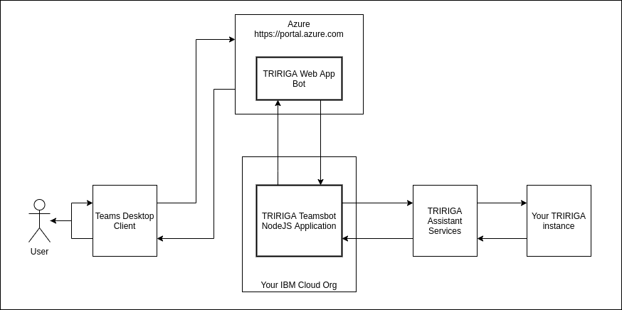

 
 

 
 

# TRIRIGA Assistant Teams Bot

A javascript application for empowering users to achieve TRIRIGA functionality through the Microsoft Teams using the Microsoft Bot Framework [More details](https://dev.botframework.com/).

Some examples of some features you can expect:
* Booking Rooms
* Opening Service Requests
* Finding Locations or People
* Answering Questions about your site



## A. Requirements
The following are required to use this software:

1. An [IBM TRIRIGA](https://www.ibm.com/products/tririga) instance that is accessible via the internet

2. Importing and performing setup steps for [TRIRIGA Assistant](https://github.com/IBM/tririga-assistant) which includes provisioning of TRIRIGA Assistant Services by the IBM AI Applications - TRIRIGA Voice Enablement team.

3. Access to a Teams workspace with privileges to create Teams applications.

4. An ***Azure*** Account

5. Latest Node.js with NPM. Download it from [here](https://nodejs.org/en/download/).

6. The [IBM Cloud CLI](https://cloud.ibm.com/docs/cli).

7. The Bot Framework Emulator for local testing. To install the Bot Framework Emulator, download it from [here](https://emulator.botframework.com/). Please refer to [this documentation article](https://github.com/microsoft/botframework-emulator/wiki/Getting-Started) to know more about the Bot Framework Emulator.

## B. Configuration

### Environment Variables
Teams-Bot has a handful of environment variables that need to be set. 

First, copy the `sample.env` file to `.env`.

Edit the `.env` file and provide the following information:

```
# TRIRIGA Assistant Info
TA_PROXY=
TA_INTEGRATION_ID=

#Microsoft Bot Info
MicrosoftAppId=
MicrosoftAppPassword=
```

#### TRIRIGA Assistant Settings
- `TA_PROXY` 
- `TA_INTEGRATION_ID` - the Integration ID provided by the IBM AI Applications - TRIRIGA Voice Enablement Team.

#### Microsoft Azure Settings
* Create an Azure account if you don't have one already
* Create a ***Web App Bot*** Resource if you don't have one
    * Find and copy down the `MicrosoftAppID` and `MicrosoftAppPassword` (In the Settings under the Configuration row)
    
## C. Testing locally

### Testing with the Bot Framework Emulator
* Install the [Bot Framework Emulator](https://docs.microsoft.com/en-us/azure/bot-service/bot-service-debug-emulator?view=azure-bot-service-4.0&tabs=csharp)
* Run the Teams Bot code using `npm start`
* Enter in the bot URL: `http://localhost:3978/api/messages` if testing locally
* Enter in the Microsoft App ID and Microsoft App Password to test

__Bot tested with Bot Framework test client:__


## D. Deployment

### Deploy as a cloud foundry application on IBM Cloud
Prerequisites: [IBM Cloud CLI](https://cloud.ibm.com/functions/learn/cli)

##### 1. Copy the `sample.manifest.yml` to `manifest.yml` and provide values as in `.env` file.

##### 2. Push the code as a cloud foundry application using the following command.

    $ ibmcloud app push
    
##### 3. Note the route in the summary output.  This is the hostname for the URL you will provide later.


#### Test in Web Chat:
* Go to the Web App Bot resource and change the Messaging endpoint to the Bluemix hosted link and make sure it ends with `/api/messages`
* Click "Test in Web Chat" 

#### Add Microsoft Teams Channel
* Click "Channels"
* Click on the purple Teams icon
* Select "Microsoft Teams Commercia"
* Click Save

#### Create app manifest package in Teams:
* Open a Teams workspace and install the App Studio app if you don't have it
* Open App Studio > Click on "Manifest editor" >  Click on "Create a new app" 
* Fill out the required information in `App details`
    * Name, Package name, Version, Description
    * Generate an App ID
* In Capabilities under `Bots`: 
    *  Set up a bot > Existing bot
    * Enter in your bot ID (same as `appID`)
* In Finish:
    * Test and distribute > Download the app 

#### Install app in Teams
* Go to `More added apps` in teams (`...` icon) > Click on `More apps`
* Click on `Upload a custom app` on the sidebar
* Upload the zip app manifest created in the previous step
* To chat with the assistant, click on the `Chat` icon in the side bar and chat with the assistant

__Conversation with Watson via Microsoft Teams:__


## More Information

To get more information about how to get started, please review the following resources:
* [IBM Bluemix](https://www.ibm.com/cloud-computing/bluemix/)
* [Watson Developer Cloud](https://www.ibm.com/watson/developer/)
* [Watson Conversation](https://www.ibm.com/watson/services/conversation/)
* [Microsoft Bot Builder for Node.js Reference](https://docs.microsoft.com/en-us/bot-framework/nodejs/)
* [Bot Framework FAQ](https://docs.microsoft.com/en-us/bot-framework/resources-bot-framework-faq#i-have-a-communication-channel-id-like-to-be-configurable-with-bot-framework-can-i-work-with-microsoft-to-do-that)

